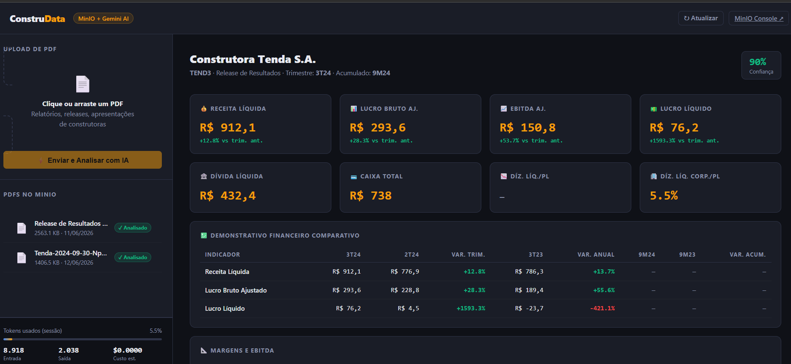

# ConstruData — Extração Inteligente de PDFs de Construtoras

Sistema de extração automática de dados estruturados de PDFs de construtoras brasileiras usando **MinIO** (storage S3-compatível) + **Google Gemini AI** (modelo `gemini-2.5-flash`).

O sistema recebe um PDF de release de resultados trimestrais de construtoras, extrai o texto via `pdfplumber`/`pypdf`, envia para a API do Gemini com um schema JSON pré-definido e retorna os dados financeiros, operacionais e de guidance de forma estruturada.

---

## Arquitetura

```
┌─────────────────────────────────────────────────────────────────────────────┐
│                          Docker Compose                                     │
│                                                                             │
│  ┌─────────────┐    upload    ┌────────────────┐    S3 API   ┌─────────┐    │
│  │  Frontend   │ ───────────► │  FastAPI API   │ ─────────►  │  MinIO  │    │
│  │  (HTML/JS)  │ ◄─────────── │  (Python)      │ ◄─────────  │ Storage │    │
│  └─────────────┘   resultados └────────────────┘             └─────────┘    │
│    (navegador)             │              │                                 │
│                    pdfplumber/pypdf   salva JSON                            │
│                            │         resultado                              │
│                            ▼                                                │
│                   ┌────────────────┐                                        │
│                   │  Google Gemini │                                        │
│                   │ (2.5 Flash)    │                                        │
│                   └────────────────┘                                        │
└─────────────────────────────────────────────────────────────────────────────┘
```

### Fluxo detalhado

1. **Upload**: O usuário envia um PDF via frontend ou API REST
2. **Storage**: O PDF é armazenado no MinIO (bucket `construtoras-pdfs`)
3. **Extração de texto**: O backend usa `pdfplumber` e `pypdf` para extrair texto e tabelas do PDF
4. **Análise com IA**: O texto extraído é enviado para o Gemini com um schema JSON rígido (definido em `ai_analyzer.py`)
5. **Resultado**: O Gemini retorna um JSON estruturado que é salvo no MinIO (bucket `resultados-json`) e devolvido ao frontend
6. **Visualização**: O frontend renderiza os dados em cards, tabelas comparativas e gráficos

### Stack Tecnológica

| Componente | Tecnologia | Descrição |
|---|---|---|
| **Storage** | MinIO | Armazena PDFs originais e JSONs de resultado (S3-compatível) |
| **Backend API** | FastAPI + Uvicorn | Endpoints REST para upload, análise e consulta |
| **Extração de texto** | pdfplumber, pypdf | Extrai texto e tabelas dos PDFs |
| **IA / LLM** | Google Gemini 2.5 Flash | Modelo gratuito (15 req/min, 1M tokens/dia) |
| **Frontend** | HTML/JS/CSS puro | Interface web para visualização dos resultados |
| **Infraestrutura** | Docker Compose | Orquestra MinIO + Backend |

---

## Configuração (`.env`)

O projeto utiliza variáveis de ambiente configuradas via arquivo `.env`. Existe um template em [`docker/.env.example`](docker/.env.example):

```env
# Chave da API Gemini (obrigatório)
# Obtenha gratuitamente em: https://aistudio.google.com/app/apikey
GEMINI_API_KEY=sua-chave-aqui

# MinIO (padrão para Docker Compose)
MINIO_ENDPOINT=localhost:9000
MINIO_ACCESS_KEY=minioadmin
MINIO_SECRET_KEY=minioadmin123
MINIO_BUCKET=construtoras-pdfs
```

Para configurar:

```bash
cd docker
cp .env.example .env
# Edite o .env e substitua "sua-chave-aqui" pela sua GEMINI_API_KEY
```

> **Como obter a chave gratuita do Gemini:**
> 1. Acesse [https://aistudio.google.com/app/apikey](https://aistudio.google.com/app/apikey)
> 2. Clique em **"Create API Key"**
> 3. Copie a chave e cole no `.env`

---

## Início Rápido

### Pré-requisitos

- Docker e Docker Compose
- Chave da API Gemini (gratuita)

### Subir com Docker

```bash
cd docker
docker compose up -d
```

Serviços disponíveis após subir:

| Serviço | URL | Descrição |
|---|---|---|
| **API** | http://localhost:8000 | Backend FastAPI |
| **Docs da API** | http://localhost:8000/docs | Swagger interativo |
| **MinIO Console** | http://localhost:9001 | Interface do MinIO (login: `minioadmin` / `minioadmin123`) |
| **Frontend** | Abrir `frontend/index.html` no browser | Interface de visualização |

### Ou rodar o backend localmente (sem Docker)

```bash
cd backend
pip install -r requirements.txt
uvicorn main:app --reload --port 8000
```

> **Nota:** Neste caso, o MinIO precisa estar rodando separadamente (via Docker ou instalação local).

---

## Frontend

O frontend (`frontend/index.html`) é uma interface web feita em **HTML/JS/CSS puro** (sem frameworks ou dependências externas). Ele existe **apenas para facilitar a avaliação e visualização dos resultados** extraídos — não é o foco principal do projeto.

O frontend permite:

- **Upload de PDFs** — arrastar e soltar ou selecionar arquivo
- **Visualizar análises** — exibe todos os dados extraídos em cards KPI, tabelas comparativas e barras de progresso
- **Listar PDFs no MinIO** — mostra quais já foram analisados
- **Monitorar tokens** — exibe consumo de tokens da sessão

Para usar, basta abrir o arquivo `frontend/index.html` diretamente no navegador (com o backend rodando).

---

## Exemplo de Saída (`exemplo.json`)

O arquivo [`exemplo.json`](../exemplo.json) contém um exemplo real de saída da extração de um release de resultados da **Construtora Tenda S.A. (TEND3) — 3T24**. Ele mostra a estrutura completa do JSON retornado pela IA.

### Estrutura do JSON de saída

O schema é definido em [`backend/ai_analyzer.py`](backend/ai_analyzer.py) e contém as seguintes seções:

#### `empresa` — Identificação da construtora
| Campo | Tipo | Exemplo |
|---|---|---|
| `nome` | string | "Construtora Tenda S.A." |
| `cnpj` | string \| null | null |
| `ticker` | string \| null | "TEND3" |
| `segmento` | string \| null | "habitação popular" |
| `site_ri` | string \| null | null |

#### `periodo` — Períodos de referência
| Campo | Tipo | Exemplo |
|---|---|---|
| `trimestre_atual` | string | "3T24" |
| `trimestre_anterior` | string | "2T24" |
| `mesmo_trimestre_ano_anterior` | string | "3T23" |
| `acumulado_atual` | string | "9M24" |
| `acumulado_ano_anterior` | string | "9M23" |

#### `financeiro` — Indicadores financeiros
Métricas com comparação trimestral e anual:

- **`receita_liquida`** — Receita líquida (R$ milhões)
- **`lucro_bruto_ajustado`** — Lucro bruto ajustado (R$ milhões)
- **`ebitda_ajustado`** — EBITDA ajustado (R$ milhões)
- **`lucro_liquido`** — Lucro líquido (R$ milhões)

Cada métrica acima contém: `atual`, `trimestre_anterior`, `var_trimestre_pct`, `mesmo_trim_ano_ant`, `var_anual_pct`, `acumulado_atual`, `acumulado_ano_ant`, `var_acumulado_pct`

Margens (com variação em pontos percentuais):
- **`margem_bruta_ajustada_pct`** — `atual`, `trimestre_anterior`, `var_trimestre_pp`, `mesmo_trim_ano_ant`, `var_anual_pp`
- **`margem_ebitda_ajustada_pct`** — mesma estrutura
- **`margem_liquida_pct`** — mesma estrutura

Indicadores de endividamento:
- `divida_liquida`, `divida_liquida_pl_pct`, `divida_liquida_corporativa_pl_pct`, `caixa_total`

#### `operacional` — Indicadores operacionais
- **`lancamentos_vgv`** — VGV lançado (com comparações)
- **`vendas_liquidas_vgv`** — VGV vendido (com comparações)
- **`vso_liquida_pct`** — Velocidade de vendas (com variação em p.p.)
- **`vgv_repassado`** — VGV repassado (com comparações)
- **`unidades_entregues`** — Unidades entregues (`atual`, `trimestre_anterior`, `mesmo_trim_ano_ant`)
- `banco_terrenos_vgv` — Banco de terrenos total
- `preco_medio_por_unidade_mil` — Preço médio por unidade (R$ mil)

#### `indices` — Indicadores de rentabilidade
| Campo | Tipo |
|---|---|
| `roe_pct` | number \| null |
| `roce_pct` | number \| null |
| `margem_ref_pct` | number \| null |

#### `guidance` — Projeções da empresa
| Campo | Tipo |
|---|---|
| `vendas_liquidas_min` / `vendas_liquidas_max` | number \| null |
| `margem_bruta_min_pct` / `margem_bruta_max_pct` | number \| null |
| `ebitda_min` / `ebitda_max` | number \| null |

#### `metadata` — Informações sobre a extração
| Campo | Tipo | Descrição |
|---|---|---|
| `tipo_documento` | string | Ex: "Release de Resultados" |
| `confianca_extracao` | number (0-1) | Grau de confiança da IA na extração |
| `campos_nao_encontrados` | [string] | Lista de campos que ficaram como null |
| `observacoes` | string \| null | Observações da IA sobre a extração |

---

## Uso via API REST

```bash
# Upload + análise em uma chamada
curl -X POST http://localhost:8000/upload-and-analyze \
  -F "file=@relatorio_construtora.pdf"

# Listar PDFs no MinIO
curl http://localhost:8000/pdfs

# Analisar PDF já armazenado no MinIO
curl -X POST "http://localhost:8000/analyze/relatorio.pdf"

# Ver resultado salvo
curl http://localhost:8000/results/relatorio_resultado.json
```

### Processamento em lote (CLI)

```bash
# Processar todos os PDFs de uma pasta
python scripts/process_batch.py /caminho/pdfs/ --output ./resultados/

# Sem enviar pro MinIO
python scripts/process_batch.py /caminho/pdfs/ --no-minio
```

---

## Estrutura do Projeto

```
projeto-4/
├── backend/
│   ├── main.py              # FastAPI — endpoints REST
│   ├── minio_client.py      # Cliente MinIO — upload/download S3
│   ├── pdf_extractor.py     # Extração de texto/tabelas do PDF
│   ├── ai_analyzer.py       # Integração Gemini API + schema JSON
│   ├── requirements.txt     # Dependências Python
│   └── Dockerfile
├── frontend/
│   └── index.html           # Interface web (avaliação de resultados)
├── docker/
│   ├── docker-compose.yml   # Orquestração MinIO + Backend
│   ├── .env                 # Variáveis de ambiente (NÃO commitar)
│   └── .env.example         # Template de variáveis
├── scripts/
│   └── process_batch.py     # CLI para processamento em lote
└── README.md
```

---

## Otimização de Tokens

O sistema aplica estratégias para reduzir o consumo de tokens do Gemini:

- **Limite por página**: máximo 3.000 caracteres por página extraída
- **Máximo de páginas**: processa até 30 páginas por PDF
- **Limite global**: máximo 18.000 caracteres de texto no prompt
- **Tabelas limitadas**: máximo 6 tabelas × 40 linhas cada
- **Modelo gratuito**: Gemini 2.5 Flash no tier free (custo US$ 0.00)
- **Monitoramento**: consumo de tokens exibido na interface e na API

---

## Interface (Frontend)

O frontend renderiza todos os dados extraídos em um dashboard interativo com KPIs, tabelas comparativas e barras de progresso:



---

## Exemplo de JSON Gerado

Abaixo está um exemplo real de saída gerada pela IA a partir de um release de resultados da **Construtora Tenda S.A. (TEND3) — 3T24** (arquivo completo em [`scripts/assets/exemplo.json`](scripts/assets/exemplo.json)):
